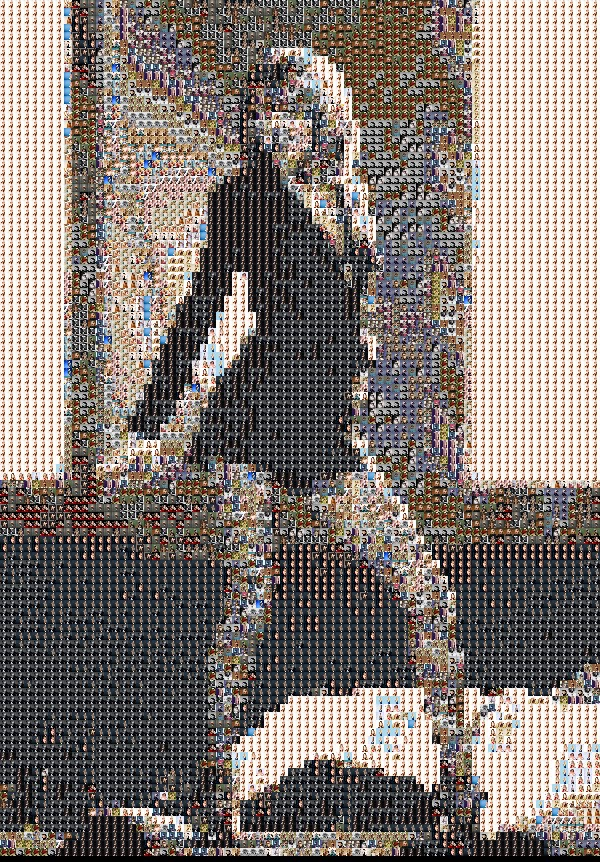

# Photo Mosaic

This is a short, fun project. it is based on <a href="https://www.youtube.com/watch?v=nnlAH1zDBDE">this tutorial</a>.<br>

<hr>

## How to use this?
```
	put your Target image in the images folder and then 
	add your images in images/all. 
	you need to set the size of the on line 20 of the code. 
	and just run it:)
```

<hr>

## Some Results


one.<br>

two.<br>

three.<br>

four.<br>